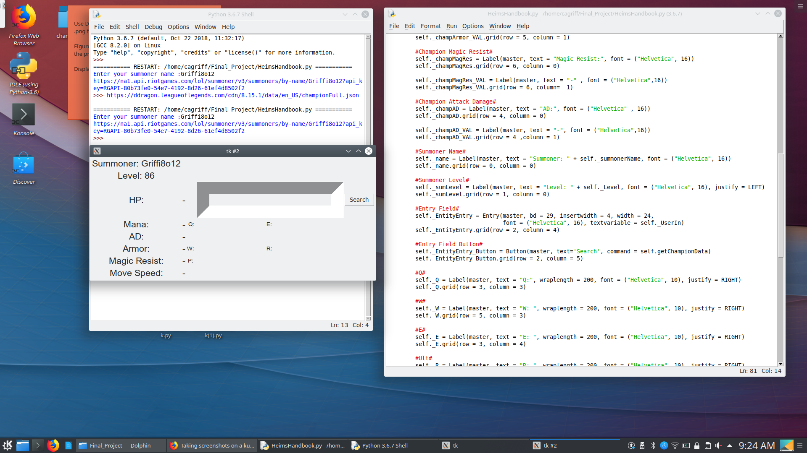

# PythonFinal
Python 3 Final Project

# Name
HeimsHandbook.py

# Description
HeimsHandbook is a database of all the champion in League of Legends, displaying champion static stats on game start. As well as minimal Summoner information

# Installation
Copy or clone the repository

# Usage
1) Login with your Lol Summoner name
2) Type in any champion nam (Jax, Annie,Vi, etc.)
3) Press the Search Button

# Requirements
1) Valid Riot Games account
2) Riot Games API Key (Create your Riot Developer Portal)
3) Insert your API key on line 19
self._URL = "https://na1.api.riotgames.com/lol/summoner/v3/summoners/by-name/" + self._summonerName + "?api_key=<YOUR_KEY>"

# Current Limitations
-Champions with character in their names, or champions that have two names (Tahm Kench, Arelion Sol) currently do not search correctly

# Contributing
This project is far from complete in my eyes and fully appreciate contributions

# License
Riot Games API
Data Dragon
